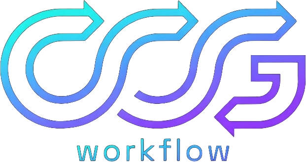
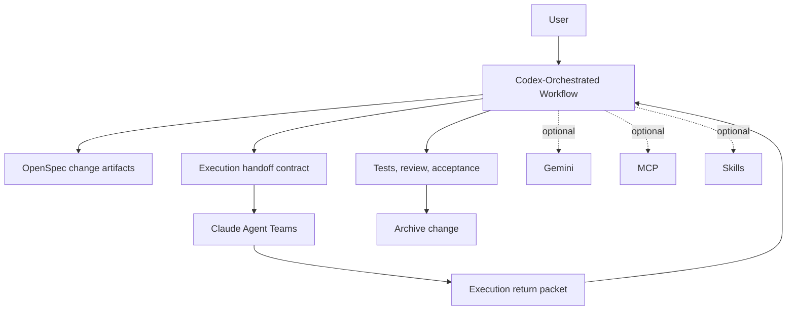

# CCGS - Codex-Orchestrated Spec Collaboration Workflow

<div align="center">



[](https://www.npmjs.com/package/ccg-workflow)
[](https://opensource.org/licenses/MIT)
[]()
[]()
[](https://x.com/CCG_Workflow)

[简体中文](./README.zh-CN.md) | English

</div>

CCGS is evolving into a Codex-orchestrated spec collaboration workflow. The extra `S` stands for `Spec`, highlighting that OpenSpec is the backbone of the maintained path. The primary path is now:

1. Codex creates and advances OpenSpec change artifacts.
2. Codex prepares an execution handoff for Claude.
3. Claude Agent Teams implement the work.
4. Codex reviews, tests, accepts, and archives.

MCP, skills, and Gemini still exist, but they are optional integrations rather than default requirements for the main path.

## Current Transition Status

- The product narrative and primary command path are Codex-led.
- Claude remains the preferred execution layer for Agent Teams.
- Legacy multi-model commands are still shipped as compatibility flows.
- Commands still install into `~/.claude/` during this migration phase so existing installs do not break.

## Primary Workflow

The recommended end-to-end path is:

```bash
/ccg:spec-init
/ccg:spec-research implement user authentication
/ccg:spec-plan
/ccg:team-plan
/ccg:team-exec
/ccg:team-review
/ccg:spec-review
```

If the change is accepted, archive it with:

```bash
openspec archive <change-id>
```

`/ccg:spec-impl` is now the managed shortcut for the same contract: Codex dispatches Claude execution, validates the result, and decides whether the change can be archived.

### Codex-Native Entrypoint

The primary workflow no longer has to begin inside Claude.

After `npx ccg-workflow init`, CCGS now also installs top-level Codex workflow skills under `~/.codex/skills/`:

- `ccg-spec-init`
- `ccg-spec-plan`
- `ccg-spec-impl`

That means the intended primary path is now:

1. Open Codex.
2. Start with `ccg-spec-init`.
3. Refine the handoff with `ccg-spec-plan`.
4. Let Codex dispatch Claude execution through `ccg-spec-impl`.

Claude slash commands still exist, but they are now the compatibility surface rather than the only runtime entrypoint.

## Compatibility Flows

These commands remain available while the repository transitions away from the older Claude-first story:

| Command | Status | Notes |
|---------|--------|-------|
| `/ccg:workflow` | Compatibility flow | Legacy full workflow surface kept for migration |
| `/ccg:plan` | Compatibility flow | Legacy multi-model planning path |
| `/ccg:execute` | Compatibility flow | Legacy execution path for existing plans |
| `/ccg:team-research` | Compatibility flow | Older research-first Team flow |
| `/ccg:frontend` | Secondary quick flow | Gemini-friendly frontend shortcut |
| `/ccg:codex-exec` | Secondary quick flow | Direct Codex execution outside the full spec/team loop |

## Command Surface

### Primary Commands

| Command | Role |
|---------|------|
| `/ccg:spec-init` | Initialize OpenSpec in the repository |
| `/ccg:spec-research` | Turn a request into a change proposal and constraints |
| `/ccg:spec-plan` | Codex refines proposal/design/tasks and creates the execution handoff |
| `/ccg:team-plan` | Codex prepares the Claude Agent Teams execution plan |
| `/ccg:team-exec` | Claude Agent Teams execute Codex-dispatched work |
| `/ccg:team-review` | Execution results return to Codex for review and rework decisions |
| `/ccg:spec-review` | Codex final acceptance gate before archive |
| `/ccg:spec-impl` | Managed dispatch + acceptance shortcut |

### Utility Commands

| Command | Role |
|---------|------|
| `/ccg:backend` | Codex-first backend quick flow |
| `/ccg:analyze` | Analysis-only workflow |
| `/ccg:debug` | Diagnose and propose fixes |
| `/ccg:optimize` | Performance investigation |
| `/ccg:test` | Test generation |
| `/ccg:review` | Code review |
| `/ccg:context` | Context logging and history compression |
| `/ccg:commit` | Smart commit |
| `/ccg:rollback` | Interactive rollback |
| `/ccg:clean-branches` | Clean merged branches |
| `/ccg:worktree` | Worktree management |
| `/ccg:init` | Initialize project guidance files |

## Why This Fork

- Codex owns the lifecycle instead of being a routed side model.
- Claude is used where it adds the most value: execution, especially Agent Teams.
- OpenSpec remains the backbone for proposal, design, tasks, review, and archive.
- Optional integrations stay available without defining the default user journey.
- Existing assets are preserved long enough to migrate safely instead of forcing a rewrite.

## Architecture



## Installation

### Prerequisites

| Dependency | Required | Notes |
|------------|----------|-------|
| Node.js 20+ | Yes | `ora@9.x` requires Node 20+ |
| Codex CLI | Recommended | Primary path is Codex-led |
| Claude Code CLI | Recommended | Needed for Claude execution flows and slash commands |
| Gemini CLI | Optional | Only for optional Gemini-assisted flows |
| MCP tools | Optional | Not required for the default workflow |
| Skills | Optional | Not required for the default workflow |

### Install

```bash
npx ccg-workflow
```

Step 2 of `npx ccg-workflow init` now asks **“Who orchestrates this workspace?”** before you pick frontend/backend execution models. Codex remains the recommended default, but you can switch back to a Claude-led compatibility path and the choice is saved into `~/.claude/.ccg/config.toml`.

During the current migration phase, CCGS still installs slash commands into Claude-compatible directories so existing setups continue to work.

At the same time, the installer now creates Codex workflow skills under `~/.codex/skills/` so the primary path can start from Codex instead of requiring Claude as the host shell.

## Optional Integrations

### MCP

MCP is no longer part of the default story. If you want code retrieval or web tooling, configure it manually from the menu:

```bash
npx ccg-workflow menu
```

### Skills

Skills are still installable and reusable, but the primary Codex-led workflow should work without them.

### Gemini

Gemini remains available for secondary frontend-heavy or comparison workflows, but it is no longer assumed in the default path.

## Key Directories

```text
~/.claude/
├── commands/ccg/           # Installed slash commands (compatibility target for now)
├── agents/ccg/             # Sub-agents
├── skills/ccg/             # Optional skills
├── bin/codeagent-wrapper   # Backend invocation wrapper
└── .ccg/
    ├── config.toml         # Workflow config
    └── prompts/            # Prompt assets

~/.codex/
└── skills/
    ├── ccg-spec-init/     # Codex-native change entrypoint
    ├── ccg-spec-plan/     # Codex-native planning + handoff
    └── ccg-spec-impl/     # Codex-native Claude dispatch + acceptance
```

## Contributing

This fork is still in the middle of the CCGS Codex-orchestrated migration. The safest contribution pattern is:

1. Open or continue an OpenSpec change.
2. Update proposal, design, specs, and tasks first.
3. Keep legacy command behavior available unless the change explicitly retires it.
4. Prefer labeling old surfaces as compatibility flows before deleting them.

General contribution guidance lives in [CONTRIBUTING.md](./CONTRIBUTING.md).

## Credits

- [cexll/myclaude](https://github.com/cexll/myclaude) - `codeagent-wrapper`
- [UfoMiao/zcf](https://github.com/UfoMiao/zcf) - Git tools
- [GudaStudio/skills](https://github.com/GuDaStudio/skills) - Earlier routing ideas

## Contact

- [@CCG_Workflow](https://x.com/CCG_Workflow) for updates and demos
- [fengshao1227@gmail.com](mailto:fengshao1227@gmail.com) for collaboration

## License

MIT
