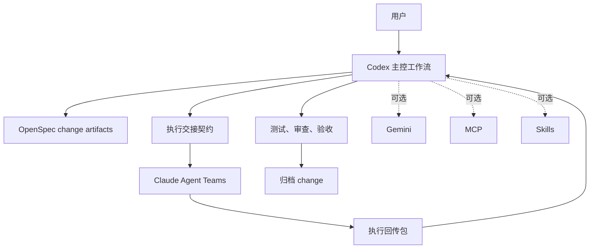

# CCGS - Codex 主控 Spec 协作工作流

<div align="center">


[](https://www.npmjs.com/package/ccg-workflow)
[](https://opensource.org/licenses/MIT)
[]()
[]()
[](https://x.com/CCG_Workflow)

简体中文 | [English](./README.md)

</div>

CCGS 是一个由 Codex 主控的 Spec 协作工作流。这里新增的 `S` 代表 `Spec`，强调 OpenSpec 是当前主路径的骨架。默认主路径是：

1. Codex 创建并推进 OpenSpec 的 change/spec/design/tasks。
2. Codex 生成执行交接契约并下发给 Claude。
3. Claude Agent Teams 负责实施。
4. Codex 回收结果，做审查、测试、验收和归档决策。

MCP、skills、Gemini 依然保留，但它们已经从默认前提降级为可选增强。

## 主工作流

推荐的完整路径是：

```bash
/ccg:spec-init
/ccg:spec-research 实现用户认证
/ccg:spec-plan
/ccg:team-plan
/ccg:team-exec
/ccg:team-review
/ccg:spec-review
```

验收通过后，再执行：

```bash
openspec archive <change-id>
```

`/ccg:spec-impl` 现在是这条主路径的快捷封装：Codex 调度 Claude 执行，随后回到 Codex 做验证，并决定是否归档。

## 兼容流

下面这些命令会继续保留，但它们属于兼容或次级入口，不代表默认产品路径：

| 命令 | 状态 | 说明 |
|------|------|------|
| `/ccg:workflow` | 兼容流 | 旧版完整工作流入口 |
| `/ccg:plan` | 兼容流 | 旧版多模型规划入口 |
| `/ccg:execute` | 兼容流 | 旧版执行入口 |
| `/ccg:team-research` | 兼容流 | 旧版 Team 研究入口 |
| `/ccg:frontend` | 次级快流 | 偏 Gemini 的前端快捷路径 |
| `/ccg:codex-exec` | 次级快流 | 不走完整 spec/team 闭环的 Codex 直执行入口 |

## 命令分层

### 主路径命令

| 命令 | 作用 |
|------|------|
| `/ccg:spec-init` | 初始化 OpenSpec 环境 |
| `/ccg:spec-research` | 将需求整理为 change proposal 和约束 |
| `/ccg:spec-plan` | 由 Codex 收敛 proposal/design/tasks，并生成执行交接契约 |
| `/ccg:team-plan` | 由 Codex 为 Claude Agent Teams 准备并行实施计划 |
| `/ccg:team-exec` | Claude Agent Teams 执行 Codex 下发的任务 |
| `/ccg:team-review` | 执行结果回流给 Codex 做质量审查和返工判断 |
| `/ccg:spec-review` | Codex 最终验收门禁 |
| `/ccg:spec-impl` | 调度执行与验收的一体化快捷命令 |

### 工具型命令

| 命令 | 作用 |
|------|------|
| `/ccg:backend` | Codex 优先的后端快流 |
| `/ccg:analyze` | 只分析，不改代码 |
| `/ccg:debug` | 问题诊断与修复路径 |
| `/ccg:optimize` | 性能分析与优化建议 |
| `/ccg:test` | 测试生成 |
| `/ccg:review` | 代码审查 |
| `/ccg:context` | 上下文日志与历史压缩 |
| `/ccg:commit` | 智能提交 |
| `/ccg:rollback` | 交互式回滚 |
| `/ccg:clean-branches` | 清理已合并分支 |
| `/ccg:worktree` | Worktree 管理 |
| `/ccg:init` | 初始化项目指导文件 |

## 为什么这样调整

- 让 Codex 真正拥有 change 生命周期，而不是只当被路由的子模型。
- 把 Claude 放在最擅长的位置：执行，尤其是 Agent Teams。
- 保留 OpenSpec 作为 proposal、design、tasks、review、archive 的主骨架。
- 保留 MCP、skills、Gemini，但不再让它们决定默认用户旅程。
- 保留兼容入口，但不让它们重新定义主路径。

## 架构



## 安装

### 前置依赖

| 依赖 | 是否必需 | 说明 |
|------|----------|------|
| Node.js 20+ | 是 | `ora@9.x` 需要 Node 20+ |
| Codex CLI | 推荐 | 默认主路径由 Codex 主控 |
| Claude Code CLI | 推荐 | Claude 执行流和 slash commands 仍会用到 |
| Gemini CLI | 可选 | 仅用于次级前端/对照流 |
| MCP 工具 | 可选 | 默认工作流不依赖 |
| Skills | 可选 | 默认工作流不依赖 |

### 安装命令

```bash
npx ccg-workflow
```

### Codex 原生入口

现在主路径不必再从 Claude 里起步。

执行 `npx ccg-workflow init` 之后，CCGS 也会把下面这些工作流 skill 安装到 `~/.codex/skills/`：

- `ccg-spec-init`
- `ccg-spec-plan`
- `ccg-spec-impl`

推荐的实际使用方式变成：

1. 打开 Codex
2. 从 `ccg-spec-init` 开始
3. 用 `ccg-spec-plan` 收敛交接边界
4. 用 `ccg-spec-impl` 让 Codex 调用 Claude 执行，并由 Codex 验收

Claude 里的 `/ccg:*` 依然保留，但现在更偏向兼容入口，而不是唯一入口。

安装流程的第 2 步会先确认“谁来做编排”，然后再选择前端/后端执行模型。Codex 仍然是推荐默认值，但如果想使用 Claude 主控的兼容路径，也可以在这里切换，这个选择会写入 `~/.claude/.ccg/config.toml`。

安装器会同时在 `~/.claude/` 下安装 Claude 兼容命令，并在 `~/.codex/skills/` 下安装 Codex 工作流 skill，让主路径从 Codex 启动，同时保留兼容入口。

## 可选增强

### MCP

MCP 已经不是默认主线的一部分。如果你需要代码检索或联网工具，可以在菜单里手动配置：

```bash
npx ccg-workflow menu
```

### Skills

skills 仍可安装和使用，但主路径不应依赖它们才能跑通。

### Gemini

Gemini 仍适合前端偏重或对照分析场景，但不再是默认链路中的强制角色。

## 关键目录

```text
~/.claude/
├── commands/ccg/           # 当前阶段的兼容安装目标
├── agents/ccg/             # 子智能体
├── skills/ccg/             # 可选 skills
├── bin/codeagent-wrapper   # 后端调用包装器
└── .ccg/
    ├── config.toml         # 工作流配置
    └── prompts/            # 提示词资产
```

## 参与开发

最稳妥的贡献方式是：

1. 先创建或继续一个 OpenSpec change。
2. 先改 proposal、design、specs、tasks，再动实现。
3. 旧命令如果还没明确退役，优先标记为兼容流，而不是直接删除。
4. 删减 MCP、skills、Gemini 前，先确保主路径已经跑通。

更多协作约定见 [CONTRIBUTING.md](./CONTRIBUTING.md)。

## 致谢

- [cexll/myclaude](https://github.com/cexll/myclaude) - `codeagent-wrapper`
- [UfoMiao/zcf](https://github.com/UfoMiao/zcf) - Git 工具
- [GudaStudio/skills](https://github.com/GuDaStudio/skills) - 早期路由思路

## 联系方式

- [@CCG_Workflow](https://x.com/CCG_Workflow) 获取更新和演示
- [fengshao1227@gmail.com](mailto:fengshao1227@gmail.com) 进行合作沟通

## License

MIT
